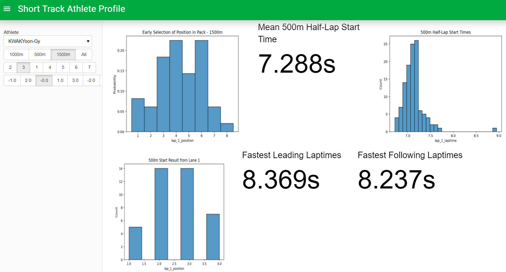
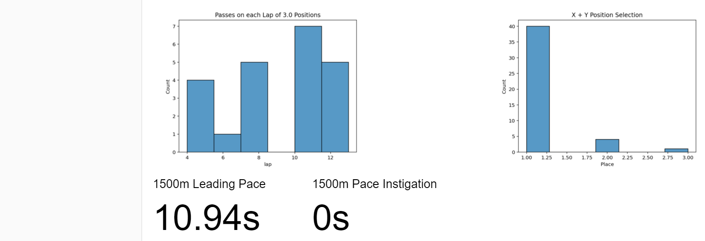

# Short Track Data Analysis
This repository extracts historical short track speed skating data and analyzes it to reveal trends.

## Data
Data for each ISU short track race since 1994 is scraped from the International Skating Union (ISU) results 
website: https://shorttrack.sportresult.com/. The scraped data (in its raw, parsed, and cleaned forms) is available at 
[data/archive/scraped](./data/archive/scraped). 

In [shorttrack-EDA.ipynb](./data/shorttrack-EDA.ipynb), the scraped data is combined into 
[rounds_splits.csv](./data/full/rounds_splits.csv), which contains one row for each athlete in each race. The 
fields contain information about the athlete (or relay team), including name, nationality, gender, starting position, 
finishing position, and finishing time. Where available, the athlete's lap split times and position at the end of 
each lap is also listed.

In [shorttrack-athlete_profile.ipynb](athlete_profile/shorttrack-athlete_profile.ipynb), the data is further broken down 
to create [individual_athlete_lap_data.csv](./data/full/individual_athlete_lap_data.zip). Each row in this file shows 
how many positions the athlete (or relay team) gained or lost during the course of one lap of one race.

#### File Size
The large number of individual files stored in [data/archive/scraped](./data/archive/scraped) may make 
this repository slow to clone or download.

[individual_athlete_lap_data.csv](./data/full/individual_athlete_lap_data.zip) is too large to commit directly, so it
has been compressed as a `.zip`. It is automatically extracted when starting up the athlete dashboard.

#### Data Terms of Use
The ISU's [terms of use](https://www.isu.org/quick-links-sep/legal-information) forbid the "permanent copying or 
storage" of their data. Whether storage on GitHub constitutes "permanence" is unclear - I will take down the data 
portion of this repository upon request.

## Athlete Profile Dashboard
Athlete trends are extracted from the dataset and displayed in an interactive dashboard. 

### Example


Kwak Yoon-Gy is known for starting the 1500m distance near the back of the pack and making a big pass near the end 
of the race. The data supports this, showing a low tendency to start in the first two positions, a skew of 
two-position passes toward the later laps, and no tendency to instigate the pace early on. He doesn't have the fastest 
top speed, show by his faster following speed than leading speed. Finally, in a race where multiple skaters advance, 
he still often goes for the top spot.

### Cloud Deployment
The dashboard is deployed at [shorttrack.herokuapp.com](https://shorttrack.herokuapp.com/). Due to memory limitations 
with the free tier of Heroku, this deployment is for demo purposes only - a limited number of athletes are included. 
To deploy with all athlete data, construct your own deployment with the instructions below.

### Local Deployment
The dashboard is generated by [shorttrack_ui.py](./athlete_profile/shorttrack_ui.py). To run the dashboard locally:
```shell script
# step 1: clone the repository to your environment of choice
git clone https://github.com/alexanderhale/shorttrack.git

# step 2: install requirements
pip install -r requirements.txt

# step 3: start Panel dashboard
panel serve athlete_profile/shorttrack_ui.py
```

The dashboard will run on `localhost` with Panel's default settings, or you can specify any 
[command-line arguments](https://panel.holoviz.org/user_guide/Deploy_and_Export.html) you wish.

## Next Steps
* Many more athlete trends could be extracted - suggestions are welcome!
    * Athletes are currently only being compared to their own results - extracting some global trends would allow 
      comparison of an athlete to other athletes (e.g. is this athlete's average start time fast, slow, or average?).
    * What is the most frequent lap that the winner of a race makes their pass to the front?
* The dashboard could do with some beautifying.
* Some machine learning could be applied to learn deeper trends - for example, is there a pattern of positions within 
  the pack that the winner often follows?

